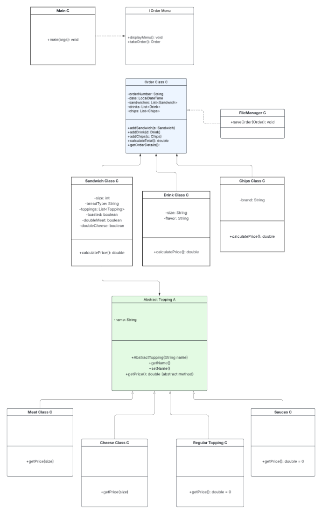

# 🥪 Pain 'n' Despair Deli (Capstone Project 2)

Welcome to Pain 'n' Despair Deli, a solo Java application built to simulate a virtual deli ordering system. Customers can create custom sandwiches, add drinks and chips, and generate a receipt — with flavor and flair included!

---

## 📷 UML Diagram

Below is the structure of the application:


---

------------------------------------------------------------------------------------------------------------------------
## 🚀 Features

✅ Create custom sandwiches with:
- Size selection (4", 8", 12")
- Choice of bread and toasted options
- Meats and cheeses (with extra selection limits and pricing rules)
- Free toppings (veggies, sauces)

✅ Add drinks and chips from predefined selections

✅ Dynamic receipt generation that:
- Shows itemized breakdown
- Separates extras
- Calculates total price

✅ Save each order to a timestamped `.txt` file in the `/receipts` directory

✅ Structured using:
- Abstract classes and inheritance
- Interfaces
- Java Streams (for menu rendering)

---

## 🛠 Tech Stack

- Java 17
- IntelliJ IDEA
- Object-Oriented Design
- Standard I/O + File I/O

---

## 📂 Project Structure

```bash
├── OrderClass/
│   ├── Sandwich/
│   │   ├── Toppings/
│   │   │   ├── ToppingsA.java
│   │   │   ├── Meats.java
│   │   │   ├── Cheese.java
│   │   │   ├── RegularTopping.java
│   │   │   └── Sauces.java
│   │   └── Sandwich.java
│   ├── Drinks.java
│   ├── Chips.java
│   └── Order.java
├── OrderFileManager/
│   └── OrderFileManager.java
├── com.pluralsight/
│   └── OrderMenu.java
├── receipts/
│   └── [timestamped order files]
------------------------------------------------------------------------------------------------------------------------
Example Receipt Output

8" Wheat (Toasted)
- Ham x2
- Swiss

Extra meats:
- Ham x1

Extra cheeses:
- Swiss x2
Sandwich Total: $12.00

Drink: large Coke - $2.50
Chips: Lays - $1.50

Total: $16.00
------------------------------------------------------------------------------------------------------------------------
```
## 🎯 Stretch Features (Optional / Completed)

- User can add **multiple sandwiches** per order

- File saving with timestamped `.txt` receipts

- Stream API used to improve iteration clarity
------------------------------------------------------------------------------------------------------------------------
## 📝 How to Use
Run the main() method from your launcher class (likely inside OrderMenu)

Follow console prompts to:

* Start a new order

* Add sandwiches, drinks, and chips

* Checkout and save receipt
------------------------------------------------------------------------------------------------------------------------
## 🌟 Bonus
* Uses Java Streams for improved menu output

* Dynamically separates extras from base toppings on receipts

* Implements capped logic (e.g., max 10 toppings, max 2 extras per meat/cheese)
------------------------------------------------------------------------------------------------------------------------
## 🧠 Lessons Learned
* Strong understanding of abstraction and polymorphism

* How to model complex real-world interactions with OOP

* Improved user interface design using command-line input

* File handling and receipt persistence
------------------------------------------------------------------------------------------------------------------------
## 🙌 Author
Built with pain and despair by Joseph Villafane Valencia

Instructor: Raymond Mr.Potato Sensei

------------------------------------------------------------------------------------------------------------------------
## Thank You!
- Thank you to all my peers all those I got help from and everyone for being present for my presentation
- Thank you to Raymond supporting me and for thinking I am a good developer!
- Thank you to my coach DJ for supporting and putting up with me LOL
- Thank you to YearUp for giving me this opportunity to develop my life/career skills and tech skills! 
I am very new to all of this.